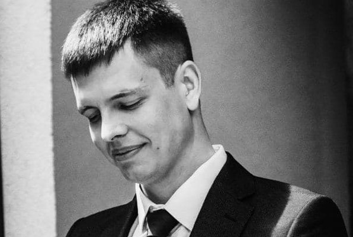

# RS School CV



## **ALEXEI MARUSOV**

**_junior frontend developer_**

### **Contacts:**

- location - Minsk
- telegram - @Alex_Marusov
- email - marusovalexei@gmail.com

---

### **Goals:**

1. Gain experience in the development of diverse projects
2. Gain experience in team development projects
3. Grow proffesionally to a Senior developer

---

### **Skills:**

- **HTML** (HTML5)
- **SCC** (SCC3, SASS/SCSS)
- **JS** (ES5/ES6, OOP)
- **Tools** (PerfectPixel, Photoshop, git, gulp)

---

### **Сode examples:**

```
function getWeekDay(date) {
const day = new Date(date);
let days = ['Sunday', 'Monday', 'Tuesday', 'Wednesday', 'Thursday', 'Friday', 'Saturday'];
return days[day.getDay()];
}
```

---

### **My projects:**

1. Sea battle  
   [project on github](https://github.com/MarusovAlexei/Sea_battle/)  
   [view the project](https://marusovalexei.github.io/Sea_battle/)

2. Site on grid  
   [project on github](https://github.com/MarusovAlexei/Homework-7-GRID-TEMPLATE/)  
   [view the project](https://marusovalexei.github.io/Homework-7-GRID-TEMPLATE/)

---

### **Education:**

- _juliy 2021 - november 2021_  
  Skillup training center  
  (https://skillup.ua/)

- _desember 2021 - until now_  
  RS School  
  (https://rs.school/)

---

### **Language:**

- English - A2-B1
- Russian - native speaker
